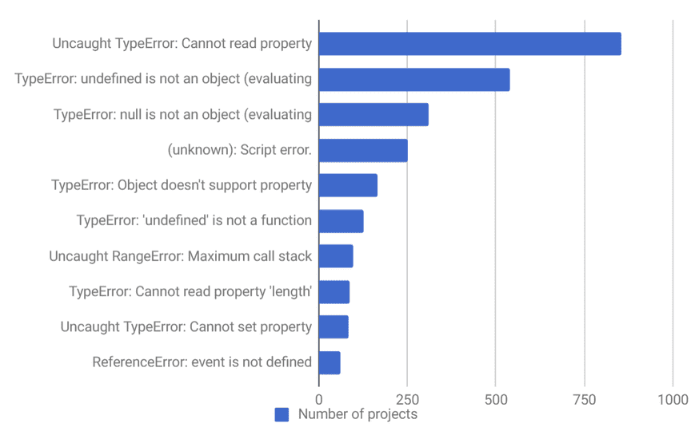

# {Blank} is Better Than TypeScript

---

# JavaScript Sucks

----
## Common Bugs


----
This is basically the cause of 

8/10 of the most common js bugs
```javascript
const user = {username: 'bob'}
const zip = user.address.zip
// :fire: :fire: :fire:
```

---

Hey! Let's add a static type checker!

---

TypeScript catches _most_ of these problems
```typescript
interface Address {
  zip: number;
}
interface User {
  username: string;
  address?: Address
}
const user: User = {username: 'bob'}
const zip = user.address.zip
// Yay, TS catches this and yells at you
```
But...

----
```typescript
const users: User[] = [{username: 'bob'}]
const user = user[0]
const username = user.username
```


---


## TypeScript Pros

- Eases Refactoring
- (Some) Type Safety
- Documentation
- Reduces bugs by 15%

---

## TypeScript Cons

- Only reduces bugs by 15%
- Still not completely type safe
- Wrestling with type deffinition files
- Requires discipline not to use `<any>`
- Type system doesn't always map easily to fp patterns
- Learning curve
- Requires client buy-in


---

## Let's take a step back
Why would someone actually do this?
```javascript
const user = {username: 'bob'}
const zip = user.address.zip
// :fire: :fire: :fire:
```
----

Because it actually looks like this
```javascript
const wtf = (badDataStructures, poorDecisions) => {
  let users = [];
  let zips = [];
  badDataStructures.forEach(bs => {
    let user = User.get(bs.userId) // Whoopsie
    users.push(user)
  })
  users.forEach(user => {
    if (user.address) { // :fire: :fire: :fire:
      const zip = user.address.zip
      zipz.push(zip)
    }
  })
  doStuffWithZips(zip)
}
```

----

## Code Smells

- I don't know when/where/how this code is getting called
- I *need* an IDE to tell me what a function paramter is
- I should refactor some code, but it's Thursday already and I don't have time to break everything

---

## Contraversial Statement:
TypeScript can paper over code smells and can lead to code that is overly complex and hard to reason about

---


### Typical JS Code Base
filthy input -> create some bugs -> call some impure functions -> create even more bugs -> (hopefully) output 

-------------------------------------------

### Typical TypeScript Code Base
filthy input -> create some well typed bugs -> call some typed impure functions -> create even more typed bugs -> (hopefully) output 

---
## Writing "Safe" Code with Design Patterns
#### and some helper libraries

---


### Typical FP JS Code Base
filthy input -> quarentine -> happy safe fun time land -> output 

 -------------

### Typical FP TS Code Base
filthy input -> quarentine -> annoying double safe okay time land -> output 

----
## Quarentine

1. Call Impure Functions
2. Validate their output
3. Transform to safe data structures

----
## Call Impure Functions
```javascript
const getData = () => axios.get('/user/1')
  .then(handleResponse);
  
getData()
```
----

## Validate 
With Joi.js
```javascript
const getData = () => axios.get('/user/1')
  .then(handleResponse);

const handleResponse = (resp) => {
  const schema = Joi.object().keys({
    username: Joi.string().alphanum().min(3).max(30).required(),
    email: Joi.string().email({ minDomainAtoms: 2 })
  })
  const result = Joi.validate(resp.data, schema
  if (result.error === null) {
    handleData(data)
  } else {
    handleError(resp)
  }
}
```

----

### Transform to Safe Data Structures
with Folktale.js

```javascript
const handleData = user => {
  const safeData = {
    ...user, 
    email: Maybe.fromNullable(user.email
  }
  useData(safeData)
}

const useData = (safeUser) => {
  const email = safeUser.email.matchWith({
    Just: ({value}) => value,
    Nothing: () => 'placeholder@email.com'
  })
  const useEmail(email)
}
```

---

## TypeScript Pros

- Eases Refactoring
- (Some) Type Safety
- Documentation
- Reduces bugs by 15%

-----------------

## FP Pros

- Eases Refactoring
- (Some) Type Safety
- (Some) Documentation
- Flexible
- Reduces bugs by 110%

---

## TypeScript Cons

- Still not completely type safe
- Wrestling with type deffinition files
- Requires discipline not to use `<any>`
- Type system doesn't always map easily to fp patterns
- Learning curve
- Requires client buy-in

------------------

## FP Cons

- Still not completely safe
- Learning curve


