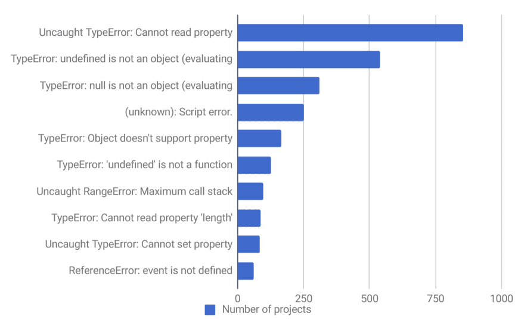

# {Blank} is Better Than TypeScript

---

# JavaScript Sucks

----
## Common Bugs


----
This is basically the cause of 

8/10 of the most common js bugs
```javascript
const user = {username: 'bob'}
const zip = user.address.zip
// :fire: :fire: :fire:
```

---

Hey! Let's add a static type checker!

---

TypeScript catches _most_ of these problems
```typescript
interface Address {
  zip: number;
}
interface User {
  username: string;
  address?: Address
}
const user: User = {username: 'bob'}
const zip = user.address.zip
// Yay, TS catches this and yells at you
```
But...

----
```typescript
const users: User[] = [{username: 'bob'}]
const user = user[1]
const username = user.username
```


---


## TypeScript Pros

- Eases Refactoring
- (Some) Type Safety
- Documentation
- Reduces bugs by 15%

---

## TypeScript Cons

- Only reduces bugs by 15%
- Still not completely type safe
- Wrestling with type definition files
- Requires discipline not to use `<any>`
- Type system doesn't always map easily to fp patterns
- Learning curve
- Requires client buy-in


---

## Let's take a step back
Why would someone actually do this?
```javascript
const user = {username: 'bob'}
const zip = user.address.zip
// :fire: :fire: :fire:
```
----

Because it actually looks like this
```javascript
const wtf = (badDataStructures, poorDecisions) => {
  let users = [];
  let zips = [];
  badDataStructures.forEach(bs => {
    let user = User.get(bs.userId) // Whoopsie
    users.push(user)
  })
  users.forEach(user => {
    if (user.address) { // :fire: :fire: :fire:
      const zip = user.address.zip
      zipz.push(zip)
    }
  })
  doStuffWithZips(zip)
}
```

----

## Code Smells

- I don't know when/where/how this code is getting called
- I *need* an IDE to tell me what a function parameter is
- I should refactor some code, but it's Thursday already and I don't have time to break everything

---

## Contraversial Statement:
TypeScript can paper over code smells and can lead to code that is overly complex and hard to reason about

---


### Typical JS Code Base
filthy input -> create some bugs -> call some impure functions -> create even more bugs -> (hopefully) output 

-------------------------------------------

### Typical TypeScript Code Base
<!-- .element: class="fragment" -->
filthy input -> create some well typed bugs -> call some typed impure functions -> create even more typed bugs -> (hopefully) output 
<!-- .element: class="fragment" -->

---
## Writing "Safe" Code with Design Patterns
#### and some helper libraries

---
#### You Don't Need a Type Checker to Check Types

Joi.js makes it easier to validate data at runtime

This has it's own pros/cons
```javascript
const schema = Joi.object().keys({
    username: Joi.string().alphanum().min(3).max(30).required(),
    password: Joi.string().regex(/^[a-zA-Z0-9]{3,30}$/),
    access_token: [Joi.string(), Joi.number()],
    birthyear: Joi.number().integer().min(1900).max(2013),
    email: Joi.string().email({ minDomainAtoms: 2 })
}).with('username', 'birthyear').without('password', 'access_token');

// Return result.
const result = Joi.validate({ 
  username: 'abc', 
  birthyear: 1994 
}, schema);
// result.error === null -> valid
```
---

You Don't Need TypeScript for Describing Complex Data Structures

Folktale.js
```javascript
const union = require('folktale/adt/union/union');

const Result = union('Result', {
  Ok(value) {
    return { value }; 
  },
  Error(reason) {
    return { reason };
  }
});

const APIError = union('APIError', {
  NetworkError(error){
    return { error };
  },
  ServiceError(code, message) {
    return { code, message };
  },
  ParsingError(error, data) {
    return { error, data };
  }
});

function handleError(error) {
  error.matchWith({
    NetworkError: ({ error }) => { ... },
    ServiceError: ({ code, message }) => { ... },
    ParsingError: ({ error, data }) => { ... }
  })
}

api.method(response => {
  response.matchWith({
    Error: ({ reason }) => handleError(reason),
    Ok:    ({ value })  => { ... }
  })
});
```
---

### Typical FP JS Code Base
filthy input -> quarantine -> happy safe fun time land -> output 

 -------------

### Typical FP TS Code Base
<!-- .element: class="fragment" -->
filthy input -> quarantine -> annoying double safe okay time land -> output 
<!-- .element: class="fragment" -->

----
## Quarantine

1. Call Impure Functions
2. Validate their output
3. Transform to safe data structures

----
## Call Impure Functions
```javascript
const getData = () => axios.get('/user/1')
  .then(handleResponse);
  
getData()
```
----

## Validate 
With Joi.js
```javascript
const getData = () => axios.get('/user/1')
  .then(handleResponse);

const handleResponse = (resp) => {
  const schema = Joi.object().keys({
    username: Joi.string().alphanum().min(3).max(30).required(),
    email: Joi.string().email({ minDomainAtoms: 2 })
  })
  const result = Joi.validate(resp.data, schema
  if (result.error === null) {
    handleData(data)
  } else {
    handleError(resp)
  }
}
```

----

### Transform to Safe Data Structures
with Folktale.js

```javascript
const handleData = user => {
  const safeData = {
    ...user, 
    email: Maybe.fromNullable(user.email)
  }
  useData(safeData)
}

const useData = (safeUser) => {
  const email = safeUser.email.matchWith({
    Just: ({value}) => value,
    Nothing: () => 'placeholder@email.com'
  })
  const useEmail(email)
}
```

----
## Flow Example

```javascript
const result = R.pipe(
  validateUserResp,
  getUser,
  manipulateUser,
  doMoreThings
)(payload)

result.matchWith({
  Ok: (user) => setState({user}),
  Error: (error) => setState({error})
})
```

---

## Fek also exists
```javascript
const schema = Obj({
  name: isString,
  race: isString,
  level: isNumber,
  friends: List(isString)
})

const goodData = {
  name: 'Carlos',
  race: 'Dwarf',
  level: 1,
  friends: ['Thanos']
}

const badData = {
  race: 'Turnip',
  level: 'bork',
  friends: ['Carrot']
}


const goodResult = validate(schema)(goodData) // -> Ok(goodData)
const badData = validate(schema)(badData) 
// -> Error([
//      {expected: 'string', received: undefined, path: ['name']},
//      {expected: 'number, received: 'bork', path: ['level']}
//    ])
```
----
## Type Coercion
```javascript
const userSchema = Obj({
  name: isString,
  age: isNumber
})
const dataSchema = Obj({
  user: Maybe(userSchema), // if user exists, it will be replaced with Just(user), otherwise Nothing()
  timestamp: isString,
  dataCode: isNumber
})

const data = {
  timestamp: '1793829384',
  dataCode: 7
}

const getName = (user) => {
  return match({
    Just: (user) => user.name,
    Nothing: () => 'Jane Doe'
  })(user)
}

const result = validate(dataSchema)(data)

const newState = match({
  Ok: (data) => {...state, name: getName(data.user)},
  Error: (err) => {...state, errorMessage: err}
})(result) 
```
---

## TypeScript Pros

- Eases Refactoring
- (Some) Type Safety
- Documentation
- Reduces bugs by 15%

-----------------

## FP Pros

- Eases Refactoring
- (Some) Type Safety
- (Some) Documentation
- Flexible
- Reduces bugs by 110%

---

## TypeScript Cons

- Still not completely type safe
- Wrestling with type definition files
- Requires discipline not to use `<any>`
- Type system doesn't always map easily to fp patterns
- Learning curve
- Requires client buy-in

------------------

## FP Cons

- Still not completely safe
- Learning curve

